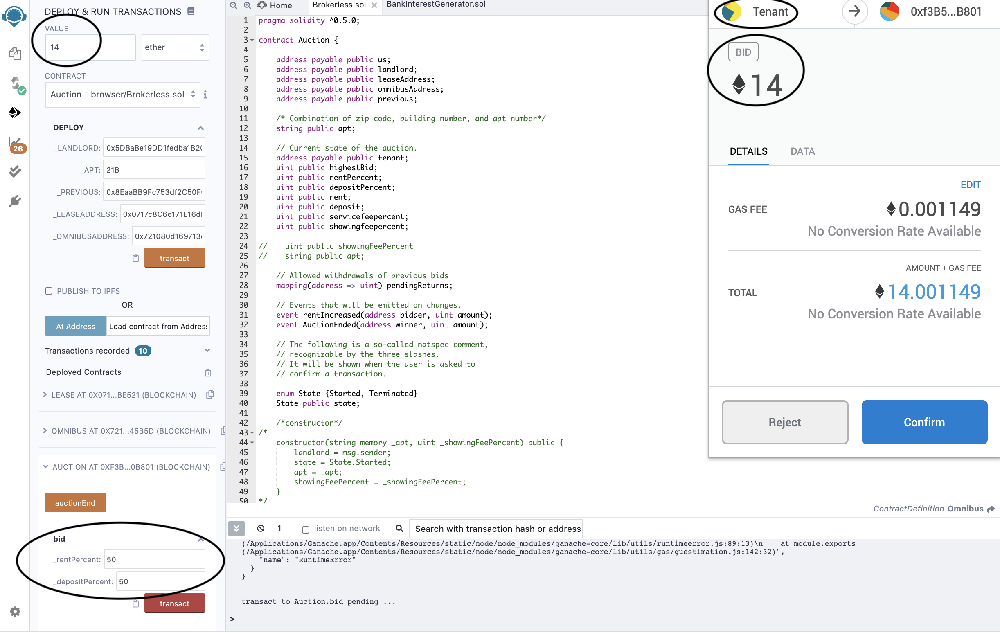
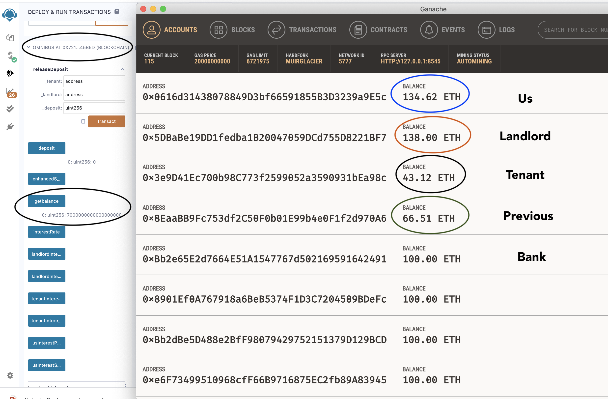

# Repertoire of Project Ensembles
_More to come. Stay tuned!_

Should there be a quartet or quintet? Acting-in-concert is our keynote token.

---

## [Brokerless Contract](https://github.com/josephpasik/brokerless-contract)

### Overview

In this project, we are helping you break free from broker hassles. Bid for your dream space on _**Brokerless**_! Our distributed ledger is built upon Solidity ethereum programming. Upon activation of the lease contract on the highest bid, you will be able to pay monthly rent through our automated blockchain network. Hakuna Matata!

Demo transactions are processed via Localhost: 8545. Interactions are confirmed on MetaMask Chrome extension. Balances of accounts are tracked in Ganache.

**Scenario A: Candidate Tenant Bid of 14 Ether on a Lease**

With 50-50 Split:
* 7 ETH goes to the deposit to Omnibus Account
* The other 7 ETH pays the Landlord, Previous Tenant and Us.

A Bid of 14 ETH on Remix Confirmed via MetaMask 

Account Balances on Ganache Prior to the Bid

Account Balances on Ganache Following the Bid

Get Balance on Omnibus AccountGanache Following the 14 ETH Bid with 50-50 Split:

**Scenario B: A Transfer of 50 ether to Omnibus Bank Account**

A Transfer of 50 ETH to Omnibus Bank Account on Remix Confirmed via MetaMask 

Account Balances on Ganache Prior to the Transfer:

Account Balances on Ganache Following the Transfer:

**Github Webpage**

Brokerless Market

---

## [Project_Maui](https://github.com/tiricha91/Project_Maui)

### Overview:
_Use News Sentiment to Predict Stock Price Movements_

Program that allows a user to choose a company from the S&P 500 and run a logistic regression model to predict the price movement of this company's stock on the next trading day based on current sentiment (Vader) of Reuters news articles related to this company.

## **UX/UI Showcase**
### _**Choose a Company**_

### _**Required Model Accuracy of 20%**_

### _**Required Model Accuracy of 63%**_

_Please wait till the end for modified recommendation. Thank you for your patience!_

---

## [Mandalorians](https://github.com/karlmunchaussen/mandalorians)

### Overview

Generation Z, are you ready for your first job?

Our goal is to develop a tool to assess the future viability/trends of different job types in New York by Borough, which will help fresh graduates assess potential career direction or existing employees understand industry trends by the job. It also will highlight which are the most attractive Boroughs for the job types.

Regardless of our ages, understanding of current job market is crutial to achieve peace of mind. The mandalorians are here to help you. A visual job market panel dashboard will incorporate job trends across five boroughs of NYC. Analysis and predictions will be available based on historical demographic records. For the purpose of our bootcamp, focus will be put on fintech, i.e. finance and technology.

_**Five types of graphs are used to analyse the trends:**_ 

* Trajectories on cumulative products for changes in full-time employment by borough
 * Example 

    * _**Interpretation**:_
        * The starting point at 1.0 suggests a 100% cumulative product in 2018 as the initial composition of the percent changes in full-time employment in Financial Specialists. 
        * By the end of 10 years, i.e. in 2028, the employment number is expected to be ranging from as low as 50% to as high as 180% of what it was in 2018.
        * By the end of 30 years, i.e. in 2028, the number of full-time financial specialists would range from a quarter to 2.7 times  of those in 2018.
        * Trajectory paths that are trending downward appear denser as years stretches further into the future. Hence, it is more likely that the number of full-time financial specialists would decrease as we move into the next three decades. 

* Trajectories on the number of full-time employment by borough
    * Example

    * Blue lines represents initial employment of females
    * Black lines represents initial male employment
    * _**Interpretation**:_ 
        * there were more female than male full-time employed as financial specialists in Queens in 2018. In a decade, the number of employment may become as low as 12,000k, i.e. doubling the about of 6,000k as shown by the lowest trajectory line at year 10, to as high as 3,200k as indicated by the yellow line on the top. 
        * Since the yellow curve would likely to fall out of 95% confidence interval, it could be an outlier and not producing trustworthy estimates. 
        * The employment figure would rather top at 4,400k, as suggested by the green line.

* 90% confidence interval chart of the simulations

    * _**Interpretation**:_
        * In Brooklyn, there is a 95% chance that an initial employment of 13,841k for male software developers will end up within in the range of 20,895k and 111,925k by the end of 2048.
        * There is a 95% chance for an initial employment of 13,841k male software developers in Brooklyn to grow to the range of 13,481k and 35,575k over the next 10 years .

* Frequency density histograms showing 95% confidence intervals on cumulative moves

    * The median employment trajectories are included with upper and lower bounds
    * _**Interpretation**:_
        * In Manhattan, there is a 72.5% chance that the number of full-time software developers would become 50 times as much as those in 2018, given by the area of the first rectangular bar, i.e. 0.0145*50 = .725.
        * It is 95% likely that the number of full-time software developers would fall in the range of zero to 170 times as much as it was in 2018, as suggested by the two fences in the graph

**Trajectories and probability histograms for Manhattan, Bronx, Brooklyn, Queens and Staten Island**

 Graphs for other boroughs 

_**To reach further, we are standing on the shoulder of current data**_

From _**Tables of Statistics**_ below, we see some interesting facts:
* Except Manhattan that has twice as many full-time male financial specialists as their female peers, all other boroughs employed more female financial specialists than males as of 2018. 
* All boroughts employed one and a half to three times as many full-time financial specialists as software developers by the end of 2018. 
* It implies that the job market for software engineers are far from reaching saturation.

 
Tables of Statistics

_**Dream of becoming a banker? Great opportunities emerge from rough times and Wah-lah, distant neighborhoods.**_

Upward trends in financial specialists appear in Brooklyn and Staten Island. Where would you pick to live and playing with numbers?

Financial Specialist Job Market Borough Comparison 

_**Software developers are hot!**_

There is an upward trend for the expected openings for software developers positions in all boroughs of NYC. However, it is possible for Bronx and Staten Island to keep a steady number of employment in this area. 

Software Developers Job Market Borough Comparison 

_**Software Developers by Gender**_

Software developers market is sizzling for male developers in all five boroughs of NYC except Bronx, which shows a more stationary market. Manhattan and Brooklyn exhibits the most potential for growth. If a female graduate in computer science were to use our tool, the implications are numerous. The aforementioned student can parse that her field is likely to see growth and if she wanted the more superior job market she would focus her job search in Brooklyn because based on our monte carlo simulation, the number of expected female software developers will grow more than the male counterpart in the next 10 years. Our tool would mean deep insight to a fresh graduate eager to explore employment opportunities. 

Graphs for gender comparison on software developers

_**Financial Specialists by Gender**_

Gentlemen in finance industry would pick Manhattan, Brooklyn and Staten Island. While Brooklyn and Staten Island are also good habitat for ladies that are looking for financial specialists positions, it's suggested that Queens would be more preferrable than Manhattan in the next 30 years. 

Graphs for gender comparison on Financial Specialists

### Discussions
Since the latest available data is from 2018, research needs to be done on recent couple of years regarding alterations in job trends. 

## References

### _Please see original repositories._
